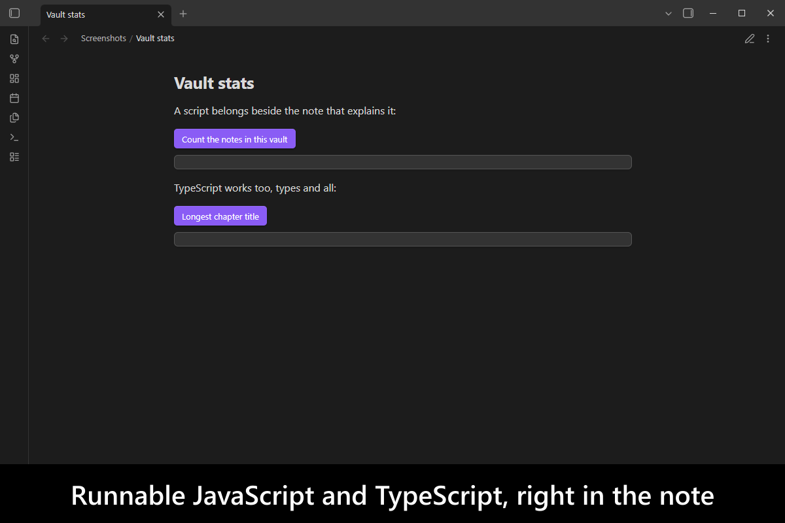
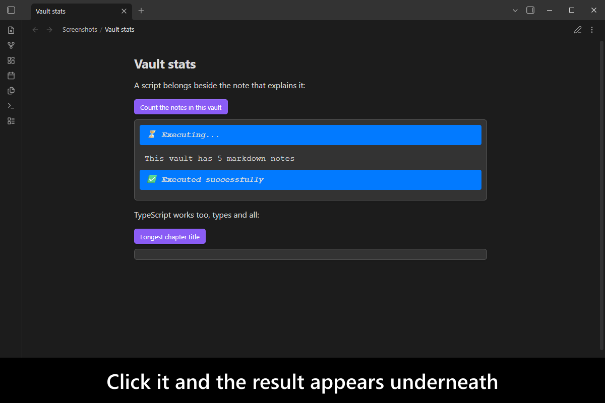
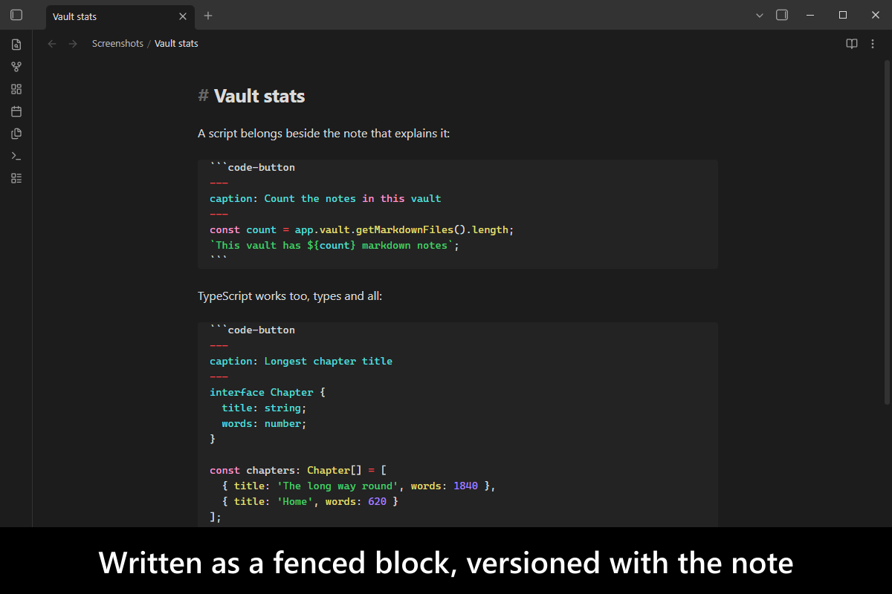
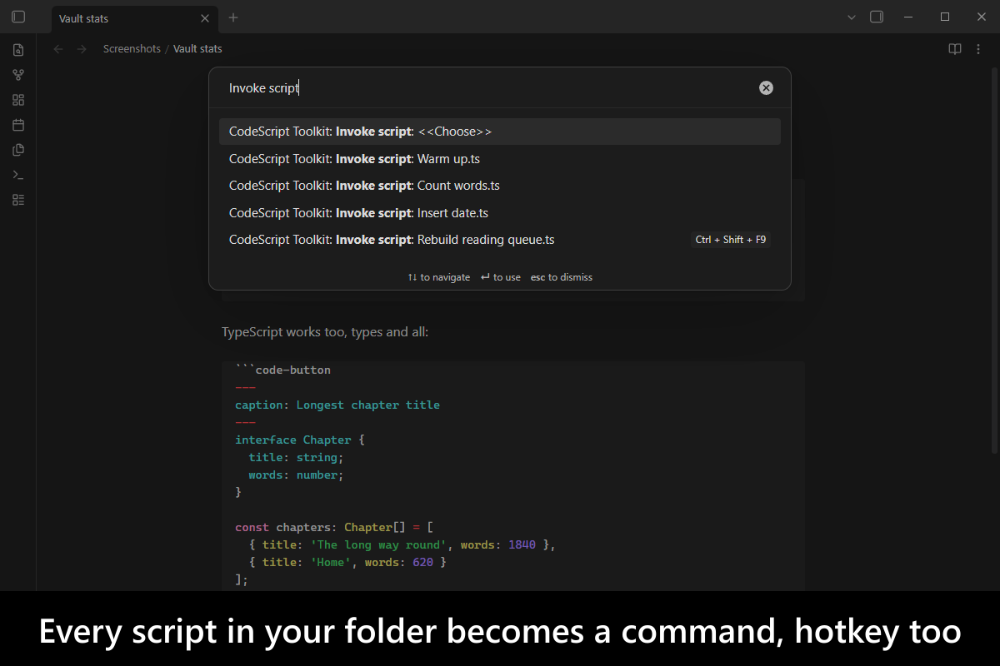
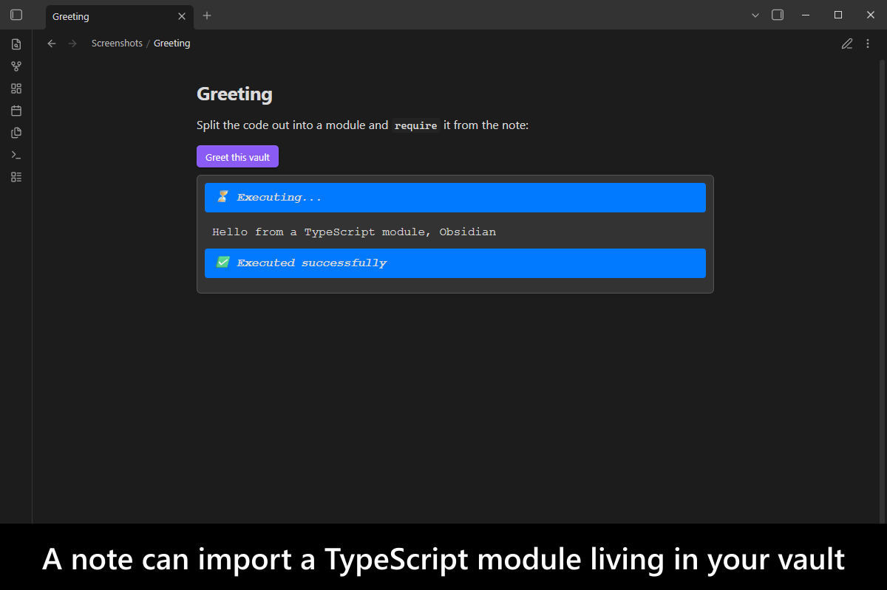
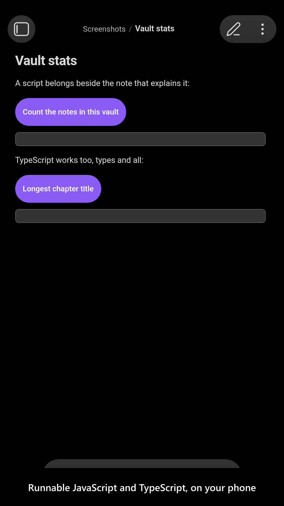
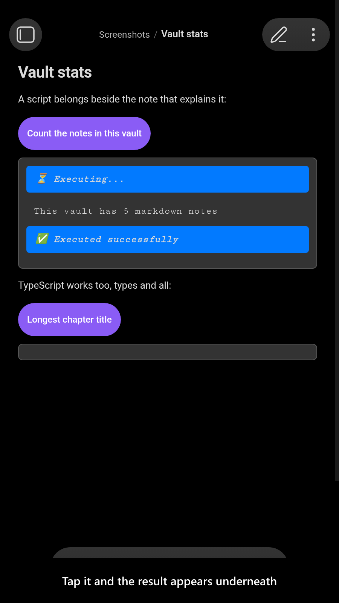
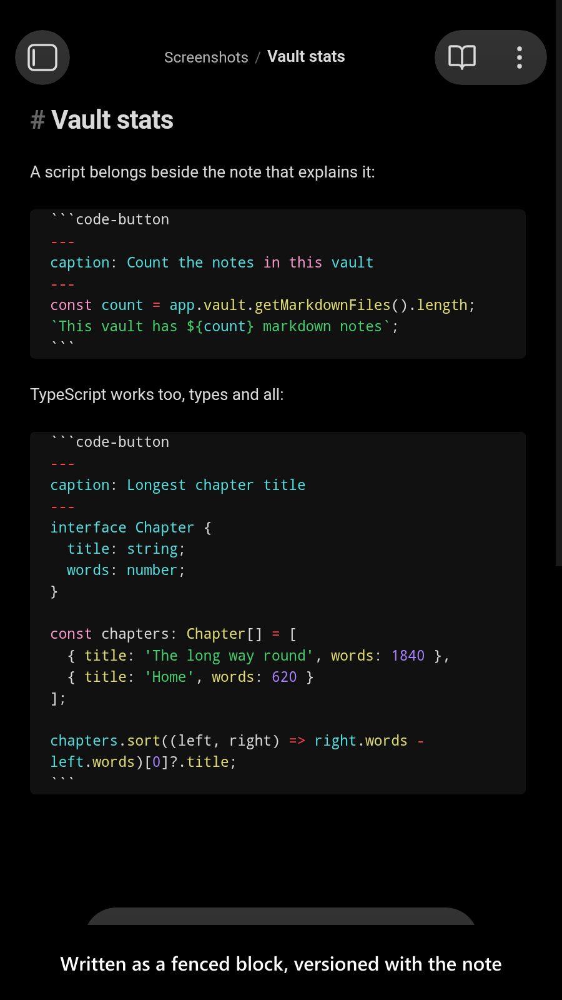
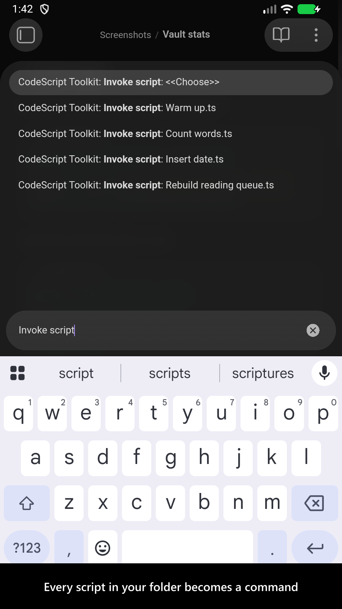
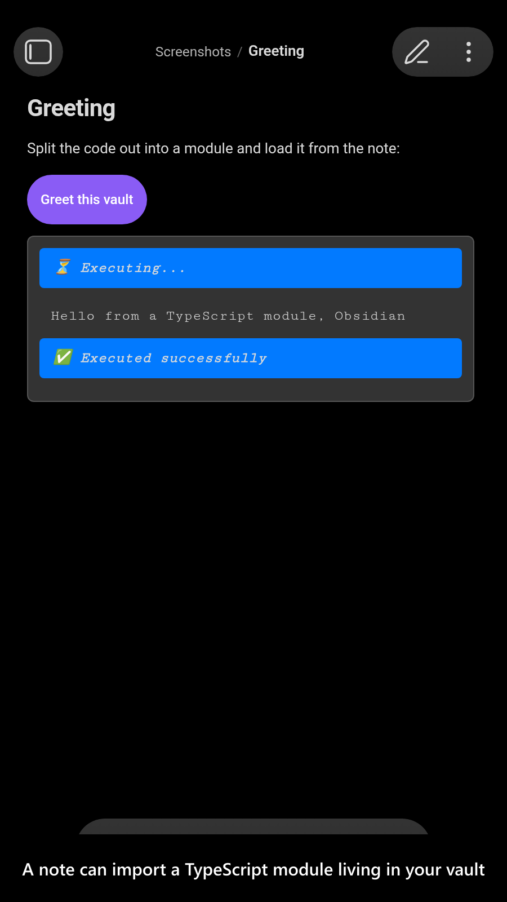

# CodeScript Toolkit

> formerly known as `Fix Require Modules`, see [Rebranding](#rebranding) section for more details

[](https://www.buymeacoffee.com/mnaoumov) [](https://github.com/mnaoumov/obsidian-codescript-toolkit/releases) [](https://github.com/mnaoumov/obsidian-codescript-toolkit/releases) [](https://github.com/mnaoumov/obsidian-codescript-toolkit)

An [Obsidian](https://obsidian.md/) plugin that lets you write and run modern JavaScript and TypeScript inside Obsidian — in a note, as a command, on a hotkey, at startup — with a rich module system, bringing you the best practices from the modern development ecosystem.

<!-- markdownlint-disable MD033 -->

<a href="https://github.com/mnaoumov/obsidian-codescript-toolkit/blob/HEAD/images/screenshots/screenshot-desktop-1.png"></a>

<details>
<summary>More screenshots</summary>

<div>
<a href="https://github.com/mnaoumov/obsidian-codescript-toolkit/blob/HEAD/images/screenshots/screenshot-desktop-2.png"></a>
<a href="https://github.com/mnaoumov/obsidian-codescript-toolkit/blob/HEAD/images/screenshots/screenshot-desktop-3.png"></a>
<a href="https://github.com/mnaoumov/obsidian-codescript-toolkit/blob/HEAD/images/screenshots/screenshot-desktop-4.png"></a>
<a href="https://github.com/mnaoumov/obsidian-codescript-toolkit/blob/HEAD/images/screenshots/screenshot-desktop-5.png"></a>
<a href="https://github.com/mnaoumov/obsidian-codescript-toolkit/blob/HEAD/images/screenshots/screenshot-mobile-1.png"></a>
<a href="https://github.com/mnaoumov/obsidian-codescript-toolkit/blob/HEAD/images/screenshots/screenshot-mobile-2.png"></a>
<a href="https://github.com/mnaoumov/obsidian-codescript-toolkit/blob/HEAD/images/screenshots/screenshot-mobile-3.png"></a>
<a href="https://github.com/mnaoumov/obsidian-codescript-toolkit/blob/HEAD/images/screenshots/screenshot-mobile-4.png"></a>
<a href="https://github.com/mnaoumov/obsidian-codescript-toolkit/blob/HEAD/images/screenshots/screenshot-mobile-5.png"></a>
</div>

</details>

<!-- markdownlint-enable MD033 -->

## Demo vault

**The documentation is an interactive demo vault.** Every feature has a note that explains what it does and why you would want it, followed by a button that runs it for real — so you can read the explanation and execute the example in the same place.

**[Start reading here](<./demo-vault/00 Start.md>)** — it works as plain markdown on GitHub, no installation needed.

A copy of the vault ships with every release. You can access it via any of the following:

1. Running the **CodeScript Toolkit: Open demo vault** command.
2. Downloading `fix-require-modules-demo-vault-<version>.zip` (`<version>` is the release version) from the [Releases](https://github.com/mnaoumov/obsidian-codescript-toolkit/releases).
3. Browsing its source in [`demo-vault/`](./demo-vault/README.md) in this repository.

If you are not sure where to start, three notes cover most of it: [Core functions](<./demo-vault/02 Core functions.md>) (which of `require()` / `requireAsync()` / `requireAsyncWrapper()` to use), [Code buttons](<./demo-vault/01 Code buttons.md>) (runnable snippets inside a note), and [Invocable scripts](<./demo-vault/06 Running scripts without a button/37 Invocable scripts.md>) (turning a script into an Obsidian command).

## What it does

- Loads CJS/ES modules, TypeScript, JSON, npm packages, Node built-ins, WebAssembly, ASAR archives and URLs with `require()` — or `await requireAsync()`, which also works on mobile.
- Runs your scripts from a note, an Obsidian command, a hotkey, a startup script, or an `obsidian://` URL.
- Lets you prototype a plugin, and explore the Obsidian API — public and internal — at runtime.
- Enriches scripting capabilities of [DevTools console](https://developer.chrome.com/docs/devtools/console).
- Enriches the scripting plugins you already use:
  - [`CustomJS`](https://community.obsidian.md/plugins/customjs)
  - [`Datacore`](https://blacksmithgu.github.io/datacore/code-views)
  - [`Dataview`](https://blacksmithgu.github.io/obsidian-dataview/api/intro/)
  - [`JS Engine`](https://www.moritzjung.dev/obsidian-js-engine-plugin-docs/)
  - [`Modules`](https://community.obsidian.md/plugins/modules)
  - [`QuickAdd`](https://quickadd.obsidian.guide/)
  - [`Templater`](https://silentvoid13.github.io/Templater/)
  - `My favorite scripting plugin not listed above` — most likely, this plugin can enrich it too.

## Installation

The plugin is available in [the official Community Plugins repository](https://community.obsidian.md/plugins/fix-require-modules).

### Beta versions

To install the latest beta release of this plugin (regardless if it is available in [the official Community Plugins repository](https://community.obsidian.md) or not), follow these steps:

1. Ensure you have the [BRAT plugin](https://community.obsidian.md/plugins/obsidian42-brat) installed and enabled.
2. Click [Install via BRAT](https://intradeus.github.io/http-protocol-redirector?r=obsidian://brat?plugin=https://github.com/mnaoumov/obsidian-codescript-toolkit).
3. An Obsidian pop-up window should appear. In the window, click the `Add plugin` button once and wait a few seconds for the plugin to install.

## Debugging

By default, debug messages for this plugin are hidden.

To show them, run the following command:

```js
window.DEBUG.enable('fix-require-modules');
```

For more details, refer to the [Obsidian Dev Utils debugging guide](https://mnaoumov.dev/obsidian-dev-utils/guides/debugging/).

## Rebranding

This plugin was formerly known as `Fix Require Modules`.

The plugin quickly overgrew its original purpose and got way more features than just fixing [`require()`](https://nodejs.org/api/modules.html#requireid) calls. That's why it got a new name.

However, for the backward compatibility, the previous id `fix-require-modules` is still used internally and you might find it

- in plugin folder name;
- in plugin URL;
- in [Debugging](#debugging) section;

## Changelog

All notable changes to this project will be documented in the [CHANGELOG](./CHANGELOG.md).

## Contributing

Contributions are welcome — see [CONTRIBUTING](./CONTRIBUTING.md) to get set up.

## Support

<!-- markdownlint-disable MD033 -->

<a href="https://www.buymeacoffee.com/mnaoumov" target="_blank"></a>

<!-- markdownlint-enable MD033 -->

## My other Obsidian resources

[See my other Obsidian resources](https://github.com/mnaoumov/obsidian-resources).

## License

© [Michael Naumov](https://github.com/mnaoumov/)
