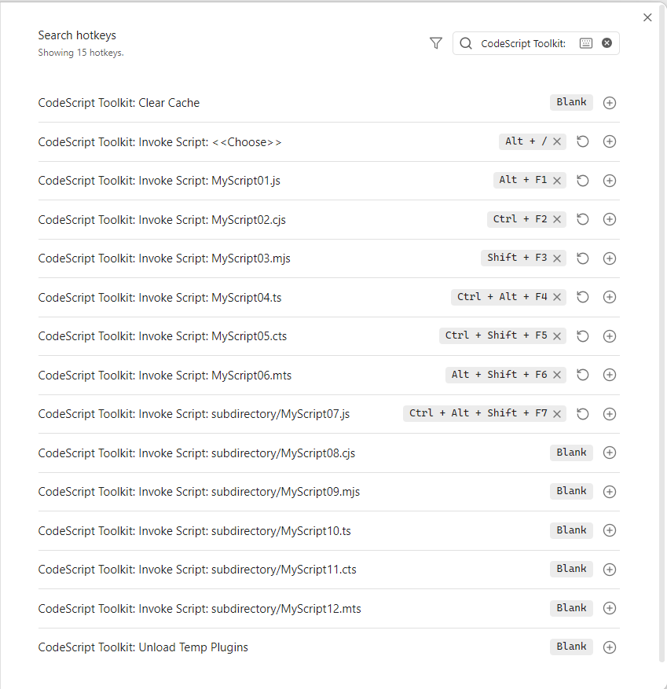

# Hotkeys

Because every [invocable script](<./37 Invocable scripts.md>) registers as an ordinary Obsidian command, you can bind one to a key in `Settings → Hotkeys` like any other. A script you run twenty times a day becomes a keystroke.

In this vault `Alt + F1` is already bound — press it and watch the script run. The binding is done in code by the vault's [startup script](<./39 Startup script.md>), `_assets/CodeScriptToolkit/startup.ts`, which is also how a script of your own could set up hotkeys for a whole team's vault.

## Platform support

| Desktop | Mobile |
| ------- | ------ |
| ✅      | ❌     |
