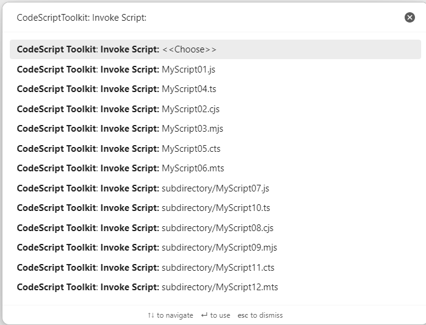
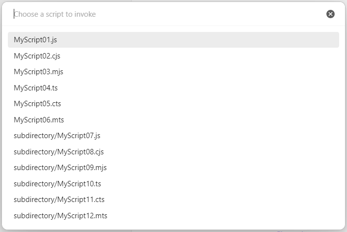

# Invoke scripts

Point the plugin at a folder, and every script in it becomes a command — no per-script registration, no configuration file. Drop a new `.ts` file into the folder and its command is there, ready to run or bind to a key.

Open the `Command Palette` and type `CodeScript Toolkit: Invoke script:` to see them all:

## Options

Once you have more than a handful of scripts, the palette gets crowded — every script contributes its own entry. `CodeScript Toolkit: Invoke script: <<Choose>>` is a single command that opens a dedicated picker instead:

The folder is the **Invocable scripts folder** setting, resolved under the modules root. In this vault it is `_assets/CodeScriptToolkit/Invocables`.

Which scripts appear, and what each command actually does, is decided by what the script exports — see [Invocable scripts](<./36 Invocable scripts.md>). Notes can be invocable too, via `isInvocable` in their frontmatter ([Markdown files](<./13 Markdown files.md>)).

## Platform support

| Desktop | Mobile |
| ------- | ------ |
| ✅      | ✅     |
