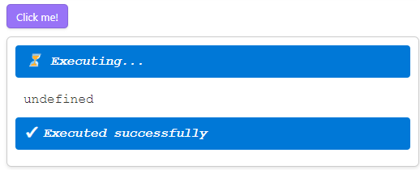

# Code buttons

A code button is a runnable snippet inside a note: you write JavaScript or TypeScript in a ` ```code-button ` block, and in Reading view it becomes a button with a results panel underneath. It is the fastest way to keep a one-off script *where it makes sense* — beside the note that explains it — instead of in a folder of files whose names you have to remember. Every button in this vault is one.

```code-button
---
caption: Click me!
---
import { Notice } from 'obsidian';

new Notice('Hello from a code button');
'the last expression is shown in the results panel below';
```



Everything the rest of this vault demonstrates works inside a button: `require()`, `import`, top-level `await`, and TypeScript syntax.

```code-button
---
caption: Everything at once
---
// CommonJS (cjs) style
const { relativePath } = require('./_assets/CodeScriptToolkit/relativePath.js');

// ES Modules (esm) style
import { Notice } from 'obsidian';

// Top-level await
const answer = await Promise.resolve(42);

// TypeScript syntax
function describe(value: number): string {
  return `the answer is ${value}`;
}

new Notice(describe(answer));
```

Two companion notes cover the details: [Code button config](<./42 Code button config.md>) for every option a button accepts, and [Code button context](<./43 Code button context.md>) for the API a running button can call.

## Buttons with no caption

Omit `caption` and the button says `(no caption)`. Fine for a scratch button; name the ones you keep.

```code-button
import { Notice } from 'obsidian';
const message = 'Button with default caption';
new Notice(message);
console.log(message);
```

## Buttons that remove themselves

`removeAfterExecution` deletes the block from the note once it has run — for a migration you only ever want to perform once. `shouldKeepGap` decides whether the surrounding blank line survives.

after removing button the gap will be left

```code-button
---
caption: Button in removeAfterExecution mode, keep gap
removeAfterExecution:
  when: always
  shouldKeepGap: true
---
import { Notice } from 'obsidian';
const message = 'Button in removeAfterExecution mode, keep gap';
new Notice(message);
console.log(message);
```

after removing button the gap will be left

after removing button the gap will NOT be left

```code-button
---
caption: Button in removeAfterExecution mode, no gap
removeAfterExecution:
  when: always
  shouldKeepGap: false
---
import { Notice } from 'obsidian';
const message = 'Button in removeAfterExecution mode, no gap';
new Notice(message);
console.log(message);
```

after removing button the gap will NOT be left

It can also be conditional — remove on success only, so a failed run leaves the button there to retry:

```code-button
---
caption: Button in removeAfterExecution mode, on success only
removeAfterExecution:
  when: onSuccess
---
import { Notice } from 'obsidian';
new Notice('Ran successfully - this button removes itself on success');
```

```code-button
---
caption: Button in removeAfterExecution mode, on error only
removeAfterExecution:
  when: onError
---
throw new Error('Failed on purpose - this button removes itself on error');
```

## Buttons that run themselves

`shouldAutoRun` runs the block as soon as the note is rendered — for a note that should show live data the moment you open it.

```code-button
---
caption: Button in shouldAutoRun=true mode
shouldAutoRun: true
---
import { Notice } from 'obsidian';
const message = 'Button in shouldAutoRun=true mode';
new Notice(message);
console.log(message);
```

`isRaw` goes further: the block renders *only* what your code puts on the page — no button, no console output, no status messages — so a code button can generate part of the note itself.

```code-button
---
isRaw: true
---
import { Notice } from 'obsidian';
const message = 'Button in raw mode: auto-executing, with nothing of its own rendered';
new Notice(message);
console.log(message);
```

## Buttons with less noise

`shouldAutoOutput: false` stops the last expression being echoed; `shouldShowSystemMessages: false` hides the *Executing…* / *Executed successfully* banners; `shouldWrapConsole: false` sends `console.log()` back to DevTools instead of the results panel.

```code-button
---
caption: Button in shouldAutoOutput=false mode
shouldAutoOutput: false
---
import { Notice } from 'obsidian';
const message = 'Button in shouldAutoOutput=false mode';
new Notice(message);
console.log(message);
```

```code-button
---
caption: Button in shouldShowSystemMessages=false mode
shouldShowSystemMessages: false
---
import { Notice } from 'obsidian';
const message = 'Button in shouldShowSystemMessages=false mode';
new Notice(message);
console.log(message);
```

```code-button
---
caption: Button in shouldWrapConsole=false mode
shouldWrapConsole: false
---
import { Notice } from 'obsidian';
const message = 'Button in shouldWrapConsole=false mode';
new Notice(message);
console.log(message);
```

## Caveats

> [!WARNING]
>
> To run a button, the plugin has to match what you clicked back to its source in the note. Two blocks with byte-identical source in the same note cannot be told apart, and the plugin shows an error instead of a button.
>
> ````markdown
> > [!NOTE]
> >
> > ```code-button
> > // Identical code button source
> > ```
> >
> > ```code-button
> > // Identical code button source
> > ```
> ````
>
> Change either one — a comment, a config key, anything — and both work again:
>
> ````markdown
> > [!NOTE]
> >
> > ```code-button
> > // No longer identical code button source
> > ```
> >
> > ```code-button
> > ---
> > someKey: someValue
> > ---
> > // No longer identical code button source
> > ```
> ````

## Platform support

| Desktop | Mobile |
| ------- | ------ |
| ✅      | ✅     |
