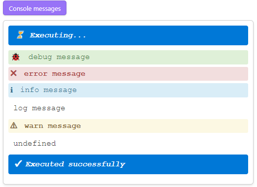

# Code button config

Every [code button](<./01 Code buttons.md>) can be configured by a YAML block at the top of its source. That is how a button gets a caption, runs itself, cleans itself up afterwards, or shows you the code behind it. All keys are optional, and every key omitted falls back to its default.

Here is the full config, with the defaults it would have anyway:

````markdown
```code-button
---
caption: (no caption)
isRaw: false
removeAfterExecution:
  shouldKeepGap: false
  when: never
shouldAutoOutput: true
shouldAutoRun: false
shouldShowSystemMessages: true
shouldWrapConsole: true
sourceVisibility: hidden
---
// Code
```
````

Rather than typing that, run **CodeScript Toolkit: Insert sample code button** to drop a fresh block at the cursor.

## Override default button config

Repeating the same three keys on every button gets old. The plugin's settings tab has a **Default code button config** field taking the same YAML, applied to every button in the vault. Individual buttons still override it — which is exactly how this demo vault turns `sourceVisibility` on everywhere without touching a single note.

## `caption` - Button text

What the button says. Without it, the button reads `(no caption)`.

## `isRaw` - Raw mode

A raw button renders only what your code puts on the page — no button, no console output, no system messages.

````markdown
```code-button
---
isRaw: true
---
await codeButtonContext.renderMarkdown('**foo**');
```
````

It implies, and overrides, the following:

```yaml
---
isRaw: true
shouldAutoOutput: false
shouldAutoRun: true
shouldShowSystemMessages: false
shouldWrapConsole: false
---
```

## `removeAfterExecution` - Remove after execution mode

Deletes the block from the note once it has run — for scripts meant to be used once. `when` is `always`, `never`, `onSuccess` or `onError`; `shouldKeepGap` decides whether the blank line stays behind.

````markdown
```code-button
---
removeAfterExecution:
  shouldKeepGap: false
  when: never
---
// Code
```
````

## `shouldAutoOutput` - Auto output mode

Code blocks echo the last evaluated expression, the way a REPL such as [`DevTools Console`][DevTools Console] does.

````markdown
```code-button
---
shouldAutoOutput: true # default
---
1 + 2;
3 + 4;
5 + 6; // this will be displayed in the results panel
```
````

Set it to `false` to keep the panel to what you print explicitly.

````markdown
```code-button
---
shouldAutoOutput: false
---
1 + 2;
3 + 4;
5 + 6; // this will NOT be displayed in the results panel
```
````

## `shouldAutoRun` - Auto running code blocks mode

Runs the block as soon as the note is rendered in `Reading mode` / `Live Preview`, instead of waiting for a click.

````markdown
```code-button
---
shouldAutoRun: true
---
// Code
```
````

## `shouldShowSystemMessages` - System messages

Whether the *⏳ Executing…* / *✅ Executed successfully* banners appear in the results panel. Turn them off for a button whose own output is the point.

## `shouldWrapConsole` - Console messages

Code blocks intercept `console.debug()`, `console.error()`, `console.info()`, `console.log()` and `console.warn()`, and show them in the results panel instead of only in DevTools.

````markdown
```code-button
---
shouldWrapConsole: true # default
---
console.debug('debug message');
console.error('error message');
console.info('info message');
console.log('log message');
console.warn('warn message');
```
````



Set it to `false` to leave `console` alone and send output back to DevTools.

````markdown
```code-button
---
shouldWrapConsole: false
---
// Code
```
````

## `sourceVisibility` - Source visibility

In Reading view a code button shows only a button — the code that makes it work is invisible, which is fine for a script you wrote and unhelpful for one you are trying to learn from. `sourceVisibility` adds a `</>` toggle beside the button that reveals the source, syntax-highlighted.

````markdown
```code-button
---
caption: Show me the code
sourceVisibility: collapsed
---
// Click the `</>` toggle beside the button to reveal this.
'hello';
```
````

```code-button
---
caption: Show me the code
sourceVisibility: collapsed
---
// Click the `</>` toggle beside the button to reveal this.
'hello';
```

| Value       | Behavior                             |
| ----------- | ------------------------------------ |
| `hidden`    | no toggle, no source panel (default) |
| `collapsed` | toggle shown, panel starts closed    |
| `expanded`  | toggle shown, panel starts open      |

Right-clicking a button offers **Copy source** and **Reveal in note**, whatever this is set to.

This is a per-vault decision more than a per-button one, so it is usually best set once in **Default code button config** — as this demo vault does.

## Caveats

`sourceVisibility` has no effect on `isRaw` buttons. A raw button owns its whole rendered element and clears it on every run, so there is nowhere for a panel to survive.

## Full spec

Every key, with its type, lives in [`src/code-button-block-config.ts`](https://github.com/mnaoumov/obsidian-codescript-toolkit/blob/main/src/code-button-block-config.ts).

[DevTools Console]: https://developer.chrome.com/docs/devtools/console
