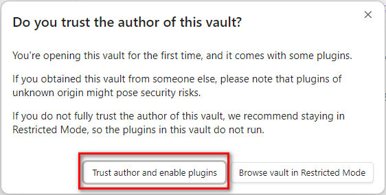
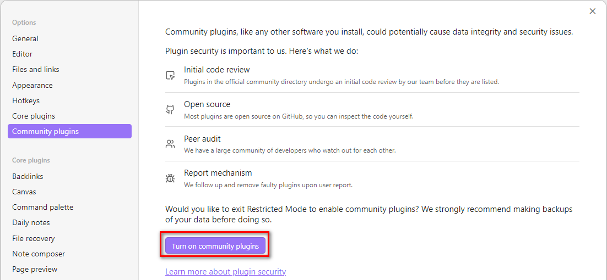

This is an [Obsidian](https://obsidian.md/) vault demonstrating features of the [CodeScript Toolkit](https://community.obsidian.md/plugins/fix-require-modules) plugin.

## Opening this vault

- **If you already have the plugin installed**, run the **CodeScript Toolkit: Open demo vault** command — it downloads and opens the latest demo vault automatically.
- **Otherwise**, download `fix-require-modules.demo-vault.zip` from the [plugin releases](https://github.com/mnaoumov/obsidian-codescript-toolkit/releases), unzip it, and in Obsidian choose `Manage vaults...` → `Open folder as vault` → select the unzipped folder.

When plugins prompt on first open, enable them using one of these methods:

- **Trust author** - to enable plugins immediately.
    
- **Enable manually** - turn on Community plugins.
    

Then open [00 Start](<./00 Start.md>).
