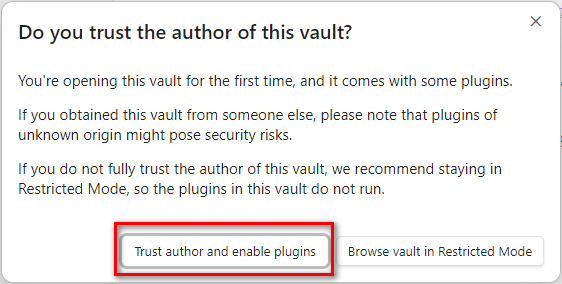
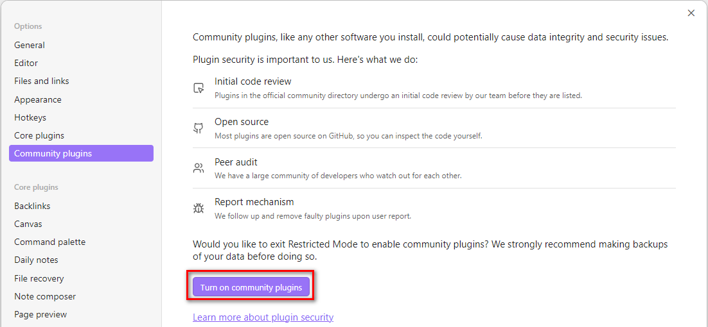

# CodeScript Toolkit demo vault

This is an [Obsidian](https://obsidian.md/) vault that documents the [CodeScript Toolkit](https://community.obsidian.md/plugins/fix-require-modules) plugin by demonstrating it. Every feature has a note explaining what it is for, with a button that runs it.

You can read it right here on GitHub — start at [00 Start](<./00 Start.md>) — or open it in Obsidian and click things, which is the point.

## Opening this vault

- **If you already have the plugin installed**, run the **CodeScript Toolkit: Open demo vault** command — it downloads and opens the latest demo vault automatically.
- **Otherwise**, download `fix-require-modules-demo-vault-<version>.zip` (`<version>` is the release version) from the [plugin releases](https://github.com/mnaoumov/obsidian-codescript-toolkit/releases), unzip it, and in Obsidian choose `Manage vaults...` → `Open folder as vault` → select the unzipped folder.

When plugins prompt on first open, enable them using one of these methods:

- **Trust author** - to enable plugins immediately.
    
- **Enable manually** - turn on Community plugins.
    

Then open [00 Start](<./00 Start.md>).

## It is a sandbox

The opened vault is a temporary copy, cleaned up automatically about a day after you last use it, and running the command again creates a fresh copy rather than reopening the old one. Experiment freely — but copy anything you want to keep into your own vault.
