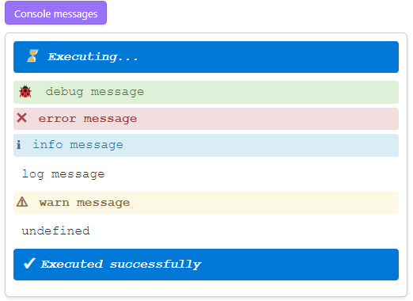

# Code button config

Code button behavior is configured via config which is an `YAML` block at the beginning of the code button block.

Below shown an example of the full config with default values.

````markdown
```code-button
---
caption: (no caption)
isRaw: false
removeAfterExecution:
  shouldKeepGap: false
  when: never
shouldAutoOutput: true
shouldAutoRun: false
shouldShowSystemMessages: true
shouldWrapConsole: true
---
// Code
```
````

The config block is optional and all keys are optional. If the config key is missing, the default value is used.

To simplify adding new button you can use command `CodeScript Toolkit: Insert sample code button`.

See [spec](../src/CodeButtonBlockConfig.ts) for all config keys.

## `isRaw` - Raw mode

Code buttons in raw mode show only the output container. Button itself, console output, system messages are hidden.

````markdown
```code-button
---
isRaw: true
---
await codeButtonContext.renderMarkdown('**foo**');
```
````

It implies the following full configuration:

```yaml
---
isRaw: true
shouldAutoOutput: false
shouldAutoRun: true
shouldShowSystemMessages: false
shouldWrapConsole: false
---
```

## `shouldAutoOutput`

Code blocks automatically output the last evaluated expression like in `REPL` environments, such as [`DevTools Console`][DevTools Console].

````markdown
```code-button
---
shouldAutoOutput: true # default
---
1 + 2;
3 + 4;
5 + 6; // this will be displayed in the results panel
```
````

To disable this feature, set the `shouldAutoOutput` setting to `false`.

````markdown
```code-button
---
shouldAutoOutput: false
---
1 + 2;
3 + 4;
5 + 6; // this will NOT be displayed in the results panel
```
````

## `shouldAutoRun`

Code blocks can be configured to run automatically when the note is switched to `Reading mode` / `Live Preview` using the `shouldAutoRun` setting.

````markdown
```code-button
---
shouldAutoRun: true
---
// Code
```
````

## `shouldWrapConsole`

Code blocks intercept all calls to `console.debug()`, `console.error()`, `console.info()`, `console.log()`, `console.warn()` and display them in the results panel.

````markdown
```code-button
---
shouldWrapConsole: true # default
---
console.debug('debug message');
console.error('error message');
console.info('info message');
console.log('log message');
console.warn('warn message');
```
````



If you do not want to intercept console messages, you can set the `shouldWrapConsole` setting to `false`.

````markdown
```code-button
---
shouldWrapConsole: false
---
// Code
```
````

## Remove after execution

| Desktop | Mobile |
| ------- | ------ |
| ✅       | ✅      |

You can configure a button to remove itself after execution:

````markdown
```code-button
---
removeAfterExecution:
  shouldKeepGap: false
  when: never
---
// Code
```
````

[DevTools Console]: https://developer.chrome.com/docs/devtools/console
