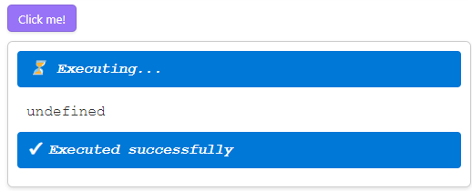

# Code buttons

| Desktop | Mobile |
| ------- | ------ |
| ✅      | ✅     |

Create code buttons that execute [`JavaScript`][JavaScript]/[`TypeScript`][TypeScript]:

````markdown
```code-button
---
caption: Click me!
---
// CommonJS (cjs) style
const { dependency1 } = require('./path/to/script1.js');

// ES Modules (esm) style
import { dependency2 } from './path/to/script2.js';

// Top-level await
await Promise.resolve(42);

// TypeScript syntax
function myTypeScriptFn(arg: string): void {}
```
````



> [!WARNING]
>
> For code buttons to work properly, the plugin has to be able to uniquely identify the code button block to its source in the markdown note.
>
> In some rare occasions, plugin fails to do so and will show an error instead of the button.
>
> In this case, you need to slightly modify the code button source to ensure such source is unique in its markdown note.
>
> **Example**:
>
> ````markdown
> > [!NOTE]
> >
> > ```code-button
> > // Identical code button source
> > ```
> >
> > ```code-button
> > // Identical code button source
> > ```
> ````
>
> The plugin is unable to distinguish those two buttons and will show an error. But if you change at least one of them:
>
> ````markdown
> > [!NOTE]
> >
> > ```code-button
> > // No longer identical code button source
> > ```
> >
> > ```code-button
> > ---
> > someKey: someValue
> > ---
> > // No longer identical code button source
> > ```
> ````
>
> The buttons are no longer identical and the plugin can distinguish them now.

## Code button config

Code button behavior is configured via config which is an `YAML` block at the beginning of the code button block.

[See details](./code-button-config.md).

## Code button context

During runtime execution of the code button block, the following variable is available `codeButtonContext`.

The variable contains all metadata and helper functions available during runtime execution.

[See details](./code-button-context.md).

[JavaScript]: https://developer.mozilla.org/en-US/docs/Web/JavaScript
[TypeScript]: https://www.typescriptlang.org/
