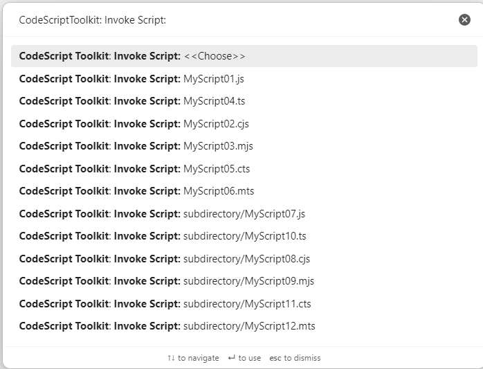
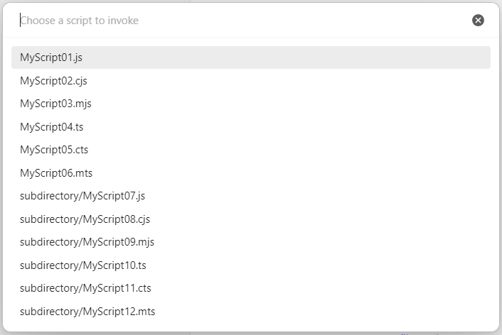

# Invoke scripts

| Desktop | Mobile |
| ------- | ------ |
| ✅      | ✅     |

Configure a script folder so every script in it can be invoked using the [`Command Palette`][Command Palette]. Use `CodeScript Toolkit: Invoke script: <<Choose>>` for more predictable lists:

[Command Palette]: https://help.obsidian.md/Plugins/Command+palette
